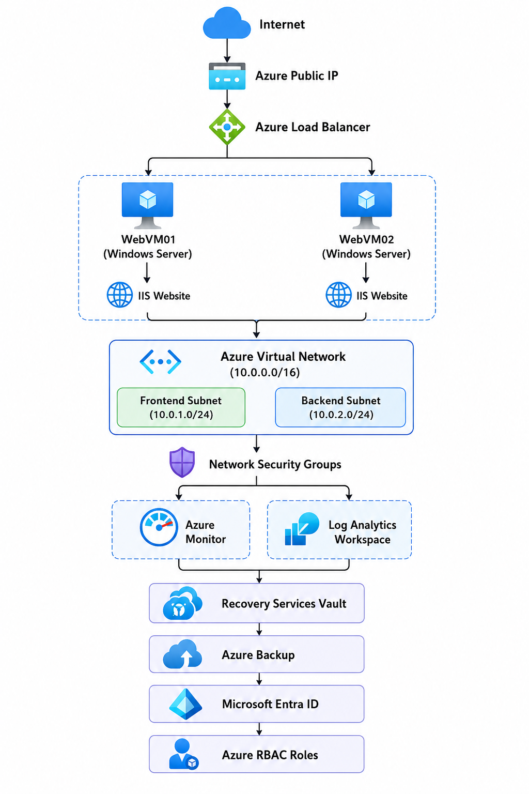

# Azure Enterprise Web Infrastructure

Azure Enterprise Web Infrastructure Project using Virtual Machines, Load Balancer, Azure Monitor, Backup and RBAC.

## Overview

This project demonstrates deployment of a highly available web application infrastructure on Microsoft Azure.

## Architecture

## Services Used

- Azure Virtual Machines
- Azure Virtual Network
- Network Security Groups
- Azure Load Balancer
- Azure Monitor
- Log Analytics Workspace
- Recovery Services Vault
- Microsoft Entra ID
- RBAC

## Features

- High Availability
- Load Balancing
- Monitoring
- Backup
- Secure Networking

## Screenshots

Available inside Screenshots folder.

## Skills Demonstrated

- Azure Administration
- Azure Networking
- Azure Monitoring
- Azure Backup
- Identity Management
- Load Balancer Configuration
